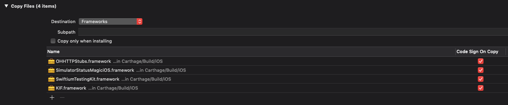

# SwiftiumKit

[](https://github.com/Carthage/Carthage) 

This "Kit" adds many feature to speed up iOS app testing. It allows to write Unit tests for testing view controllers "quicker than UI Tests".

## Example :

```swift
func testWaitForTapableTextAndTapIt_shouldHaveTap() {
    // Given
    let solo = STKSolo()
    let viewController = ViewController()
    solo.showViewControllerInCleanWindow(viewController)

    // When
    let waitForText = solo.waitFor(tappableText:"Hello button", andTapIt:true)
    
    // Expect
    XCTAssertTrue(waitForText)
    XCTAssertTrue(viewController.tapped)
}
```

see more in [STKSoloTests.swift](https://github.com/openium/SwiftiumTestingKit/blob/master/STKTestAppTests/STKSoloTests.swift)

## Installation 

### Carthage

[Carthage](https://github.com/Carthage/Carthage) is a decentralized dependency manager that builds your dependencies and provides you with binary frameworks.

You can install Carthage with [Homebrew](https://brew.sh/) using the following command:

```bash
$ brew update
$ brew install carthage
```

To integrate Alamofire into your Xcode project using Carthage, specify it in your `Cartfile`:

```ogdl
github "openium/SwiftiumTestingKit" ~> latest
```

Run `carthage update` to build the framework and drag the built `SwiftiumTestingKit.framework` into your Xcode project.

### Setup

Add the following frameworks to your test target and add a `Copy Files` with `frameworks` destimations to your test target build phases:
- `SimulatorStatusMagiciOS.framework`
- `OHHTTPStubs.framework`
- `SwiftiumTestingKit.framework`
- `KIF.framework`

 

# To be done :

Add CONTRIBUTING & CODE_OF_CONDUCT files

## Change log

We follow [keepachangelog.com](http://keepachangelog.com) recommandations for our [CHANGELOG]

[CHANGELOG]: CHANGELOG.md
